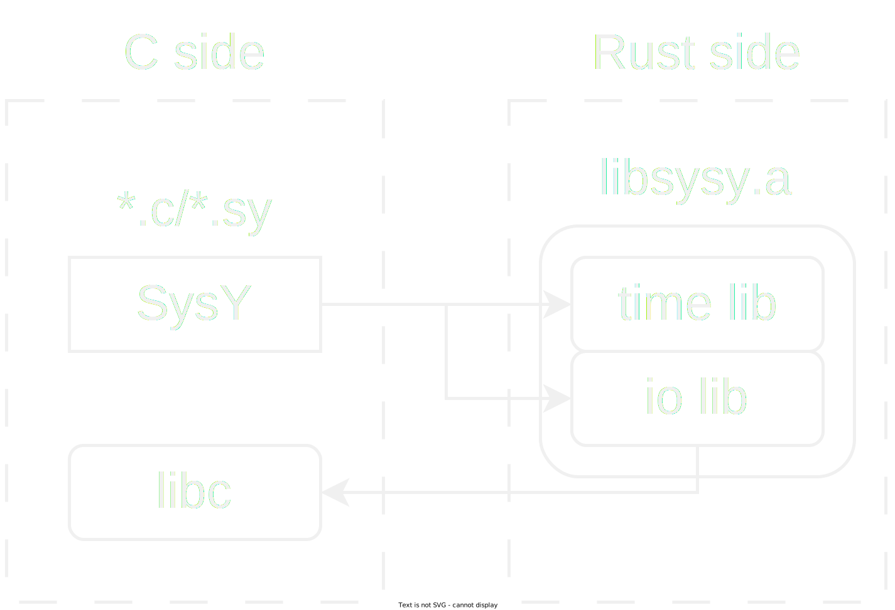

# libsysy-rs

A rust implementation of [libsysy](https://gitlab.eduxiji.net/nscscc/compiler2023/-/blob/master/SysY2022%E8%BF%90%E8%A1%8C%E6%97%B6%E5%BA%93-V1.pdf), the static link library with i/o and timer of SysY, a subset of c language for cscc compiler competition.

## Usage

To build the library, run `cargo build -r` and the artifact is at `target/release/libsysy.a`. To link with c or assambly code, run `gcc -static -o <binary> <c source/assembly code> libsysy.a` and get a static-linked executable binary.

There is an example, enter `example` directory and execute `./run.sh` to run the example.

## Structure

## Features

- Fully compatible with the official libsysy in C
- `libc` api calls in rust
- Data transfer between rust and c via raw pointer and `unsafe`
- Module constructor and destructor in rust with `ctor` crate
